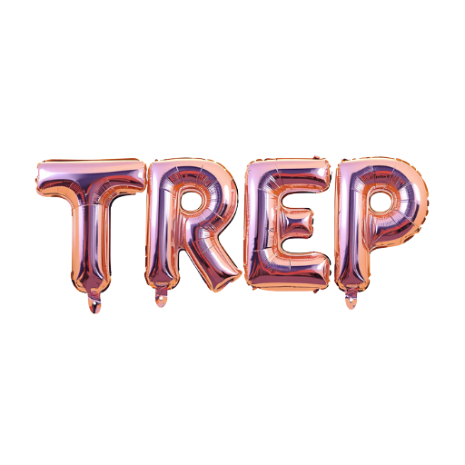

# Trep — Imágenes con IA



Trep es una aplicación web progresiva (PWA) para generar imágenes con inteligencia artificial usando [Pollinations AI](https://pollinations.ai/).

## Arquitectura

```
trep/
├── public/                      # Archivos estáticos
│   ├── favicon.ico              # Favicon (16/32/48px desde icono-sinfondo)
│   ├── icono.png                # Icono PWA con fondo
│   ├── icono-sinfondo.png       # Icono sin fondo (logo principal)
│   ├── galery/                  # Imágenes de la galería
│   │   ├── gato-en-el-espacio-con-un-traje-espacial.jpg
│   │   ├── genera-a-messi-abrazando-a-critiano-ronaldo.jpg
│   │   └── ... (10 imágenes)
│   └── sw.js                    # Service worker (caching offline)
├── src/
│   ├── app/                     # App Router de Next.js
│   │   ├── api/
│   │   │   └── generate/route.ts   # API route POST
│   │   ├── galeria/page.tsx     # Galería de imágenes (grid 3 cols)
│   │   ├── generar/page.tsx     # Generador en página dedicada
│   │   ├── globals.css          # Tailwind v4 + tema violeta
│   │   ├── layout.tsx           # Layout raíz con metadata PWA + favicon
│   │   ├── manifest.ts          # Manifest de PWA dinámico
│   │   └── page.tsx             # Landing page
│   └── components/
│       ├── Header.tsx           # Nav responsive (client component)
│       └── ImageGenerator.tsx   # Generador de imágenes (client component)
├── next.config.ts               # Config: remote patterns, headers PWA
└── package.json
```

## Páginas

| Ruta | Descripción |
|---|---|
| `/` | Landing page con hero y sección "Cómo funciona" |
| `/generar` | Generador de imágenes con IA |
| `/galeria` | Galería con imágenes de la comunidad |

## Tecnologías

- **Next.js 16** + TypeScript — SSR, App Router, SEO nativo
- **Tailwind CSS v4** — Estilos utility-first sin CSS mezclado
- **PWA** — Manifest, Service Worker, meta tags para instalación offline
- **Pollinations AI** — API de generación de imágenes por IA

## Características

| Característica | Detalle |
|---|---|
| **SEO** | Meta tags, Open Graph, `generateMetadata`, viewport dinámico |
| **SSR/SSG** | Next.js Server Components renderizan del lado del servidor |
| **PWA** | Instalable en mobile/desktop, funciona offline (caché) |
| **Mobile First** | Diseñado desde mobile hacia desktop con Tailwind |
| **Responsive** | Header con hamburguesa en mobile, nav completo en desktop |
| **API segura** | El prompt se envía por POST al backend, la imagen se devuelve como URL |
| **Tema oscuro** | Paleta de violetas oscuros con acentos violeta vibrante |
| **Favicon** | Icono sin fondo en formato .ico (16/32/48px) |
| **Galería** | Grid 3 columnas con imágenes de diferentes tamaños |

## Escalabilidad

- **Server Components** para contenido estático (landing, SEO)
- **Client Components** aislados para interactividad (Header, generador)
- **API Routes** de Next.js para abstraer llamadas externas
- **Caché del SW** para assets estáticos y navegación offline
- La generación de imágenes delega en Pollinations, sin consumo de GPU propia

## Cómo empezar

```bash
npm install
npm run dev
```

## Build

```bash
npm run build
npm start
```

## Uso

1. Escribí un prompt descriptivo (ej: "Un gato astronauta en el espacio")
2. Presioná "Generar"
3. La IA crea la imagen al instante
4. Descargala o compartila
